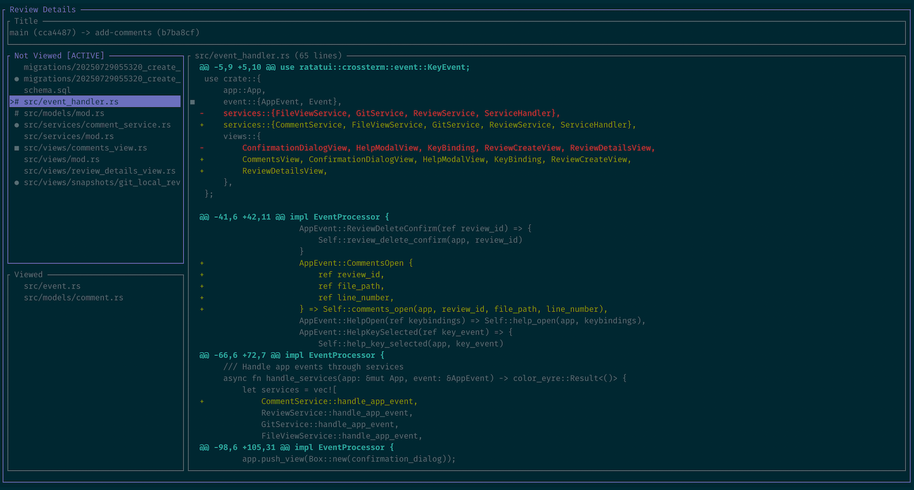

[](https://crates.io/crates/git-local-review)

# git-local-review

A Terminal User Interface (TUI) application for reviewing Git changes locally.



## Features

- **Review functionality**: Mark files as viewed, comments that can be marked as resolved
- **Review management**: Create, list, delete and view and local Git reviews
- **Modern TUI**
- **Local storage**: SQLite database for managing review state and comments

For software architecure notes, see [ARCHITECTURE.md](ARCHITECTURE.md).

## Why though?

Sometimes you might want to review the changes you made without opening a pull request yet. Or the Git server that your team uses might not have the user experience you would like to have when keeping track of the changes and what you already looked at. In any case, it's a nice project to work with Rust ;)

## Installation and Usage

```bash
cargo install git-local-review
git-local-review
```

> NOTE: This will create a `./tmp` folder with an SQLite database and a log file.

For keybindings see [KEYBINDINGS.md](KEYBINDINGS.md).

## Development

### Prerequisites

- Rust version >= `1.88.0`
- [just](https://github.com/casey/just) task runner

### Quick Start

```bash
# Clone the repository
git clone git@github.com:peterfication/git-local-review.git
cd git-local-review

# Run the steps from the CI pipeline
just ci

# Run the application
just run

# Or use cargo directly
cargo run
```

### Available Commands

All development tasks are managed via `just`:

Some examples:

```bash
just run      # Run the application
just test     # Run all tests
just lint     # Run clippy linting
just format   # Format code with rustfmt
just build    # Build the project
just doc      # Generate documentation
just ci       # Run full CI pipeline (format, lint, test, build, doc)
```

### Disclaimer regarding AI / Coding LLMs

The start of this project was made possible through the usage of coding LLMs. However, the coding LLMs were tightly managed and directed. All generated code was reviewed thoroughly and adapted where needed.

## License

This project is licensed under the MIT license ([LICENSE](LICENSE) or [opensource.org/licenses/MIT](https://opensource.org/licenses/MIT))
